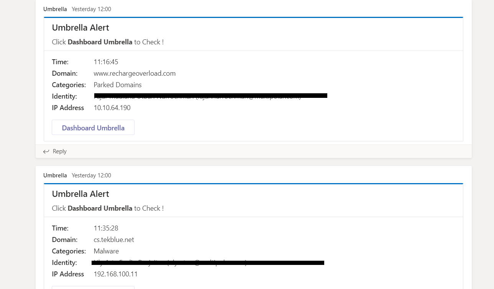

# umbrella-alert-2-msteam


send umbrella alert ( Malware / Potentially Harmful ) to MSTEAM 

[](https://developer.cisco.com/codeexchange/github/repo/mcello4001213/alert-umbrella-msteam)
 
## Use Case Description

this tools send alert to msteam if anyone in your organization have access the malware / harmful site.
you can find out how many people access dangerous sites in a day with this script.

## Installation
----Clone this script----
1. git clone https://github.com/mcello4001213/umbrella_alert_to_msteam.git
2. pip install requests
-------------------------

----API Umbrella Key----
<br>https://docs.umbrella.com/umbrella-api/docs/management-api-documentation<br>
1. Navigate to Admin > API Keys and click Create.
2. Create reporting API
3. Encoded the API using base64 > Save the result
-------------------------

----Add an incoming webhook to a Teams channell----
1. Navigate to the channel where you want to add the webhook and select (•••) More Options from the top navigation bar.
2. Choose Connectors from the drop-down menu and search for Incoming Webhook.
3. Select the Configure button, provide a name, and, optionally, upload an image avatar for your webhook.
4. The dialog window will present a unique URL that will map to the channel. Make sure that you copy and save the URL—you will need to provide it to the outside service.
-------------------------

## Configuration
Edit the script alert.py :

1. change <your organization id> with your organization ID umbrella
2. change <base64-encoded string username:password.> with your base64 encoded report Umbrella API
3. change <teams webhook url> with your team webhook url

## Usage

Usage for the code is really simple.

```
url = "https://management.api.umbrella.com/auth/v2/oauth2/token"
dns_top = "https://reports.api.umbrella.com/v2/organizations/"+organizationID+"/activity/dns"

header = {
  'Authorization': 'Basic <base64-encoded string username:password.>'
}
"""
'categories':'109' << Potentially harmful
'categories':'67' << Malware
'
"""
params ={'from':epoc_past,'to':epoc_now,'limit':'100','offset':'0','identitytypes':'directory_user','verdict':'blocked','categories':'109,67'}
def get_tok():
    r = session.request("POST", url, headers=header)
    body=json.loads(r.content)
    return body['access_token']

def get_dns_top(access_token,dns_top,params):
    r=session.request("GET",dns_top,headers={'Authorization':'Bearer '+access_token},params=params)
    body=json.loads(r.content)
    return body

def sendtoteams(data):
    date_time=datetime.strptime(data[1],'%H:%M:%S')
    timenow=date_time.time()
    webhook_url = '<teams webhook url>'

```

As you can see, you can see 3 function :
function get_tok for get the bearer token.
function get_dns_top for query the blocked requests.
function sendtoteams for sending the data to msteam.

you can using crontab in linux for run this script for every 1 hour or you can customize the hour in variable 'hours' (default=1), if you change to '2', you can get the results from 2 hours ago.

## Results
<br>
<br>

## How to test the software

Provide details on steps to test, versions of components/dependencies against which code was tested, date the code was last tested, etc. 
If the repo includes automated tests, detail how to run those tests.
If the repo is instrumented with a continuous testing framework, that is even better.


## Known issues
If you have questions, concerns, bug reports, etc., please create an issue against this [GitHub Repo](https://github.com/veprimk/csv2nornir_inventory/issues) and please make sure to include your code and the error log/traceback.


## Getting involved

If you would like to get involved, please create a pull requests and make your changes.

## Author(s)

This project was written and is maintained by the following individuals:

* Agustinus Marcello <agustinus.marcello@gmail.com>
